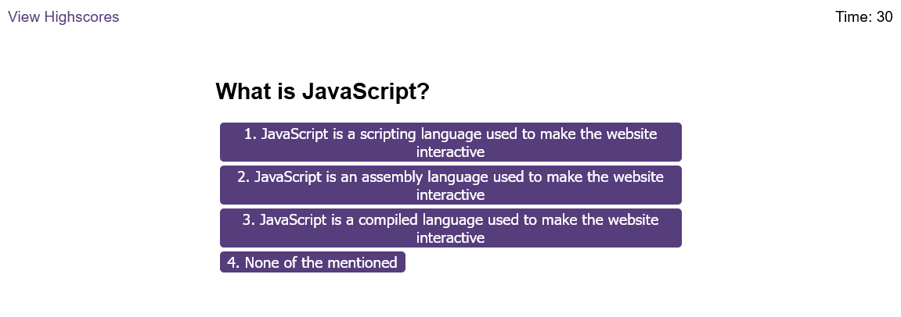
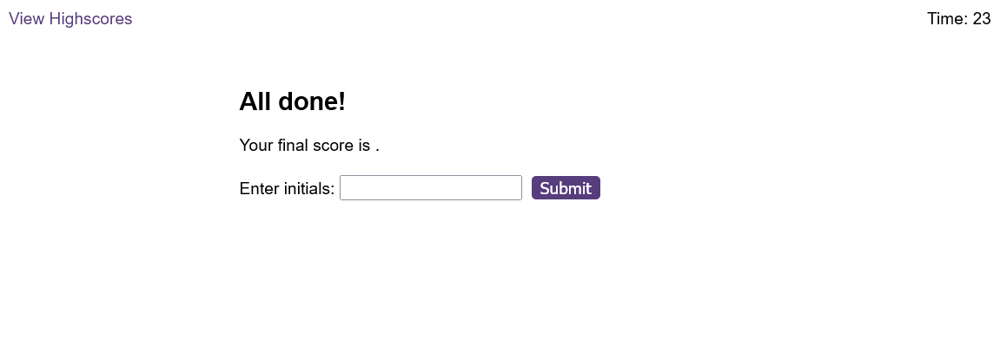
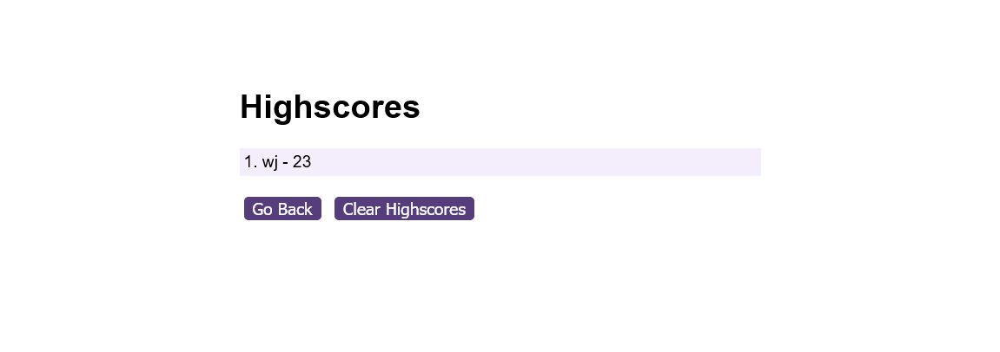

# Code Quiz

## Description

A timed coding quiz with multiple-choice questions. This app runs in the browser, and features dynamically updated HTML and CSS powered by JavaScript code. It has a clean, polished, and responsive user interface.

## Installation

N/A

## Usage

The user should click the 'Start Quiz' button and try to answer the multiple choice questions, by clicking on the answer choices.

This is a timed quiz to put pressure on the user. If the user answers incorrectly then a time penalty is applied.

At the end of the quiz the user is able to add their score to the highscores, which are based on the time they finished the quiz in, including time penalties.

View deployed application:
[Code Quiz](https://warrentyler.github.io/code-quiz/)

An Example Question.

The user can enter their name to store in high scores list.

The highscores list with one entry.

## Credits

Thanks to Helena.

## License

N/A.
